# Configuración del servidor para página web
## Instalación de Nginx
```c++
sudo apt update 
sudo apt install nginx
```
## Firewall del servidor 
Para habilitar http y https en el servidor.
```c++
sudo ufw allow 'Nginx Full'
```
Para habilitar la conexión con SSH.
```c++
sudo ufw allow 'OpenSSH'
sudo ufw enable
```
Para habilitar el firewall del servidor.
```c++
sudo ufw enable
```
# Configuración para el dominio de función pública
Para crear un bloque en Nginx para el dominio de función pública.
```c++
sudo mkdir -p /var/www/g25funcion.ga/html
```
Para darle propiedad del directorio creado al usuario ubuntu
```c++
sudo chown -R $USER:$USER /var/www/g25funcion.ga/html
```
Para darle permisos al archivo del bloque
```c++
sudo chmod -R 755 /var/www/g25funcion.ga
```
Para editar el archivo de configuración de Nginx para el dominio de función pública
```c++
sudo nano /etc/nginx/sites-available/g25funcion.ga
```
Para habilitar el bloque de Nginx para el dominio de función pública
```c++
sudo ln -s /etc/nginx/sites-available/g25funcion.ga /etc/nginx/sites-enabled/
```
Para testear la configuración de Nginx
```c++
sudo nginx -t 
```
Para reinicar el servicio de Nginx
```c++
sudo systemctl restart nginx 
```
# Configuración del certificado ssl para el dominio de función pública
Se utilizan los certificados de Let's Encrypt y se hace uso de "certbot" para que se encargue de crear las configuraciones necesarias del ceritficado.

Para instalar certbot
```c++
sudo apt install certbot python3-certbot-nginx
```
Para generar el certificado del dominio g25funcion.ga
```c++
sudo certbot --nginx -d g25funcion.ga
```


------------------------------------------------
# Configuración para el dominio de desarrollo
Para crear un bloque en Nginx para el dominio de función pública.
```c++
sudo mkdir -p /var/www/g25desarrollo.ga/html
```
Para darle propiedad del directorio creado al usuario ubuntu
```c++
sudo chown -R $USER:$USER /var/www/g25desarrollo.ga/html
```
Para darle permisos al archivo del bloque
```c++
sudo chmod -R 755 /var/www/g25desarrollo.ga
```
Para editar el archivo de configuración de Nginx para el dominio de función pública
```c++
sudo nano /etc/nginx/sites-available/g25desarrollo.ga
```
Para habilitar el bloque de Nginx para el dominio de función pública
```c++
sudo ln -s /etc/nginx/sites-available/g25desarrollo.ga /etc/nginx/sites-enabled/
```
Para testear la configuración de Nginx
```c++
sudo nginx -t 
```
Para reinicar el servicio de Nginx
```c++
sudo systemctl restart nginx 
```
# Configuración del certificado ssl para el dominio de desarrollo
Se utilizan los certificados de Let's Encrypt y se hace uso de "certbot" para que se encargue de crear las configuraciones necesarias del ceritficado.

Para instalar certbot
```c++
sudo apt install certbot python3-certbot-nginx
```
Para generar el certificado del dominio g25funcion.ga
```c++
sudo certbot --nginx -d g25desarrollo.ga
```

-------------------------------------------------
## Cofiguración del servidor para la base de datos MongoDB
Para instalar un docker en el servidor 
```c++
sudo apt update
sudo apt-get docker
```
Se crea una carpeta para la base, "mongo-files"
```c++
mkdir mongo-files
```
Para correr un contenedor con mongodb para facilitar su uso
```c++
sudo docker run -d -p 27017:27017 -v ~/mongo-files:/data/db --name mymongo mongo:latest
```
Para ingresar al contenedor y poder crear la base de datos
```c++
sudo docker exec -it mymongo bash
```
Para iniciar la consola de mongodb
```c++
mongosh
```

# Configuración del backend y frontend

## Instalación de node
Se utiliza una herramienta de ayuda para una instalación mucho más fácil, el backend se desarrollo usando NodeJS
```c++
sudo apt update
sudo apt install wget
wget -qO- https://raw.githubusercontent.com/creationix/nvm/v0.34.0/install.sh | bash
source ~/.profile
nvm ls-remote
nvm install "version que se desea trabajar"
```

## Instalación de Angular Cli
Se utiliza el siguiente comando para instalarlo ya que el frontend se desarrollo con el framework Angular.
```c++
npm install -g @angular/cli
```
## Instalación de PM2
Esta herramienta permite mantener siempre activas las aplicaciones y volver a cargarlas sin ningún tiempo de inactividad, a la vez que facilita tareas comunes de administrador del sistema.
```c++
npm install pm2 -g
```
Para ejecutar el backend
```c++
pm2 start index.js
```
Para ejecutar el frontend
```c++
pm2 start "ng serve --host 0.0.0.0 --disable-host-check"
```
# Registro del dominio g25funcion.ga
Se utilizó el proveedor de dominios Freenom para obtener un dominio gratuito.

Se configuraron los registros NS, cambiando los que maneja Freenom con los que nos brinda Route53
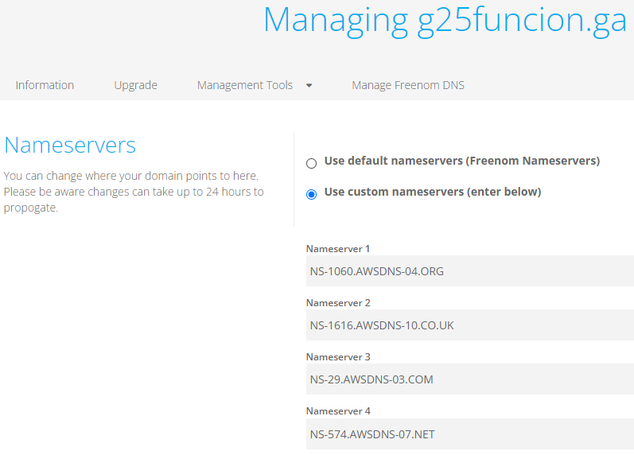

# Registro del dominio g25desarrollo.ga
Se utilizó el proveedor de dominios Freenom para obtener un dominio gratuito.

Se configuraron los registros NS, cambiando los que maneja Freenom con los que nos brinda Route53
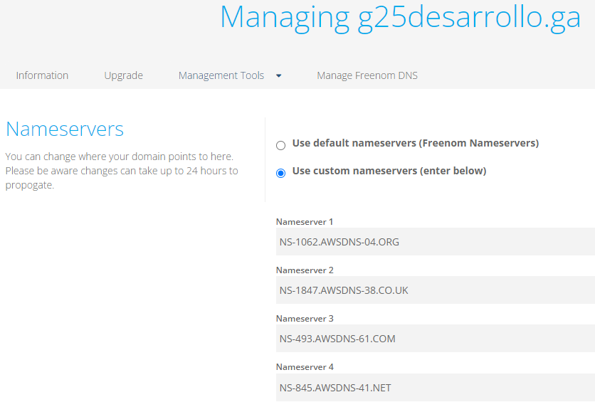

# Configuración de las zonas alojadas públicas
Se creó una zona alojada pública para cada dominio a utilizar en el servicio de AWS Route 53
## Para el dominio g25funcion.ga
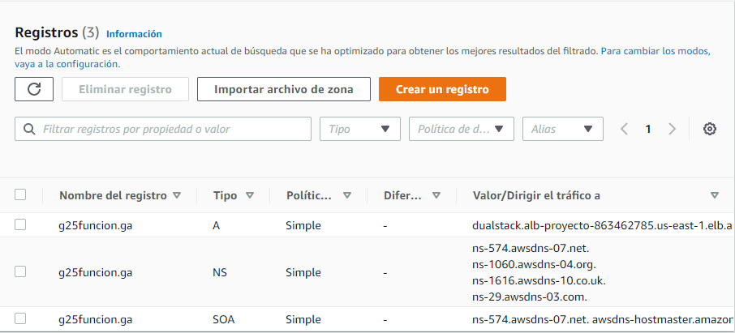

El registro tipo A se utiliza para redirigir el tráfico al balanceador de cargas
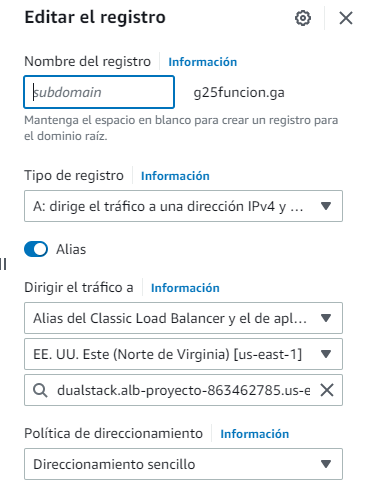

## Para el dominio g25desarrollo.ga
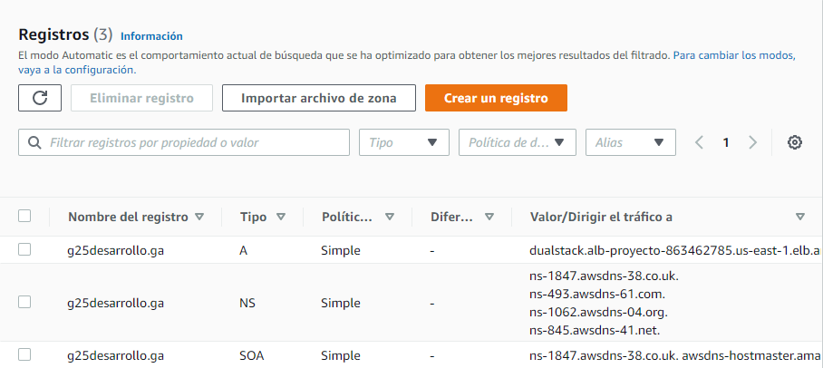

El registro tipo A se utiliza para redirigir el tráfico al balanceador de cargas
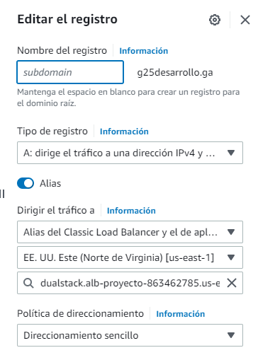

# Configuración del Application LoadBalancer
La arquitectura pide un balanceador de cargas para mantener el tráfico controlado y balanceado hacia los dos servidores de las páginas web.
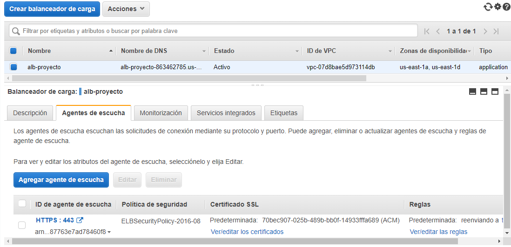

El balanceador utiliza un agente de escucha "listener" que distribuye el tráfico a un grupo de destino "Target Group" compuesto por las dos instancias EC2 utilizando el puerto 443 que es el indicado para HTTPS.
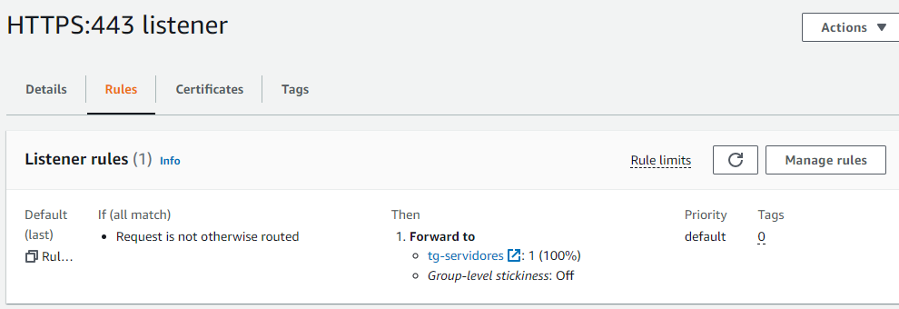

Para que el balanceador sea capaz de redirigir el tráfico a las instancias por medio de HTTPS, es necesario cargar los certificados generados por el certbot de Let's Encrypt al agente de escucha "listener" para que la petición funcione correctamente.
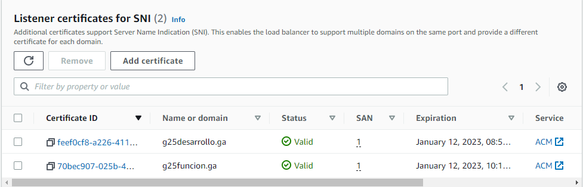

Para acceder a estos certificados es necesario ingresar al servidor con la siguiente ruta.
```c++
/etc/letsencrypt/live/g25desarrollo.ga
/etc/letsencrypt/live/g25funcion.ga
```
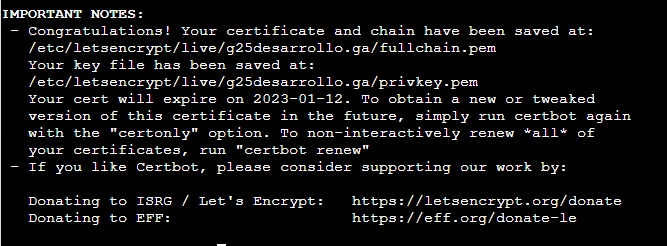
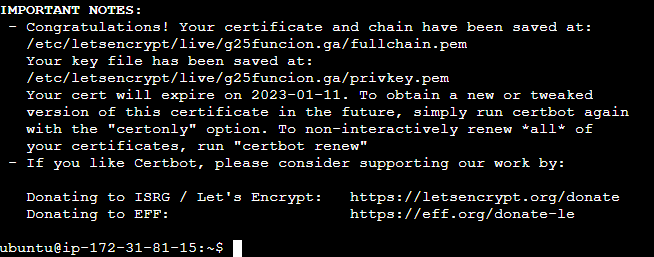

Para cargar los certificados leer los archivos cert.pem, privkey.pem y fullchain.pem e instarlos en el listener del balanceador.
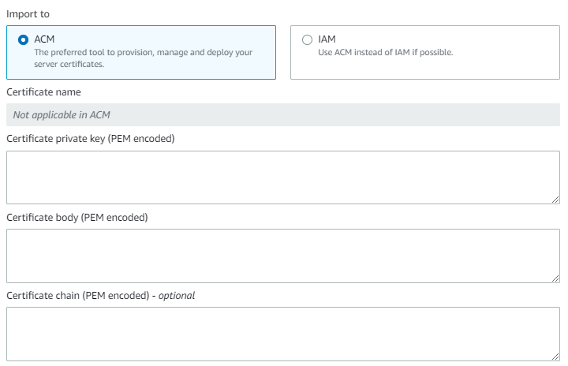

# Configuración de grupo de seguridad de los servidores web
Para que los servidores estén resguardados y no acepten tráfico de cualquier lugar se configuro que solamente acepte trafico a proveniente del LoadBlancer, esto se logra indicandole a través de las reglas que el origen del tráfico sea del grupo de seguridad en el que se encuentra el LoadBalancer.
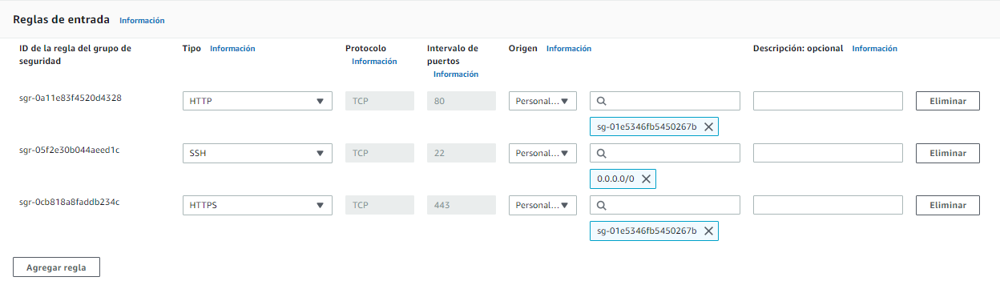

# Configuración de grupo de seguridad del servidor de mongo
Para que el servidor este resguardado y no acepte tráfico de cualquier lugar se configuro que solamente acepte tráfico a proveniente de los servidores de la página web, esto se logra indicandole a través de las reglas que el origen del tráfico sea del grupo de seguridad donde se encuentran los servidores y de ciertas direcciones IP para su gestionamiento.
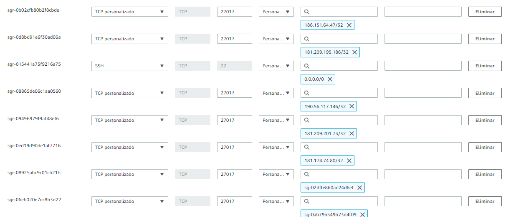

# Almacenamiento bucket S3
Para almacenar las imagenes desplegadas en la página web fue necesario el uso de una bucket.
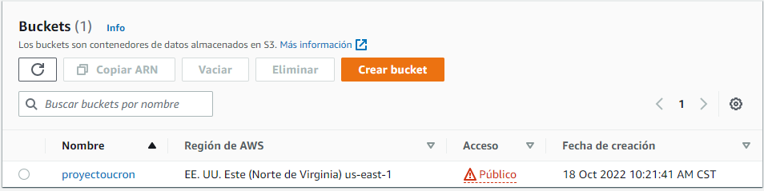
